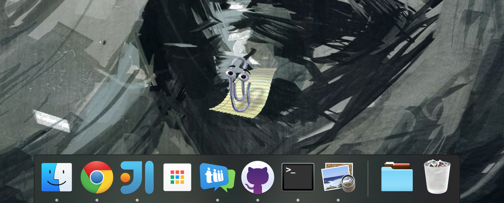

# clippy.desktop

Bringing Clippy back to the desktop (including Mac and Linux). See the blog post: [Resurrecting Clippy](https://engineroom.teamwork.com/resurrecting-clippy)

See [teamwork.github.io/clippy.desktop](https://teamwork.github.io/clippy.desktop) or [dist/](dist/) for downloads.

See [CONTRIBUTING.md](CONTRIBUTING.md) if you want to improve clippy.desktop.
